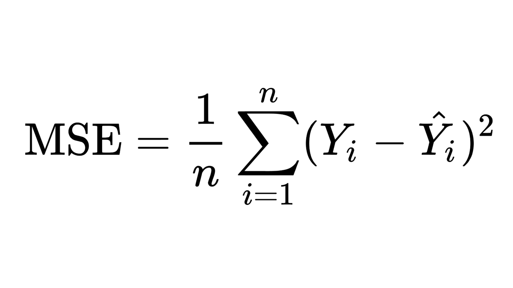
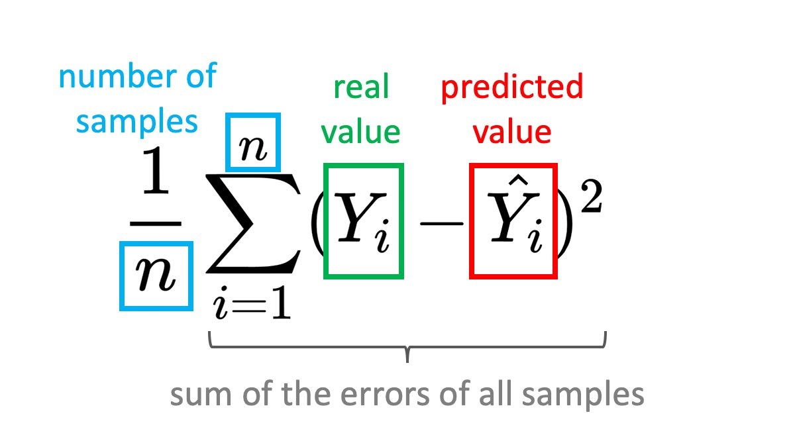

# SUBOPTIMAL - Seriously Unnecessary Baffling Obscure Perplexing Terms In MAchine Learning

Starting with Machine Learning is difficult... Everybody is using complicated and confusing terms 🤔? There are complicated math formulas everywhere 😳? You don't understand anything 😬?

Don't worry, you came to the right place! This page will explain those perplexing terms in human language. And let me tell you a secret... most things are actually not that hard! 😉

## Machine Learning Terms

<table>
<thead>
<tr>
<th>Term</th>
<th>Human Language Translation</th>
</tr>
</thead>
<tbody>
<tr>
<td valign="top">Rectified Linear Unit (ReLU)</td>
<td>
    
A simple function of `x` returning 0 if `x < 0` or `x` otherwise

    

</td>
</tr>
<tr>
<td valign="top">Embedding</td>
<td>
    
A representation of an object as a list of numers.

    
Embeddings are commonly used to create representations of objects or features that are suitable for particular machine learning algorithms.

    
One example is working with words in Natural Language Processing. Words are usually transformed to a list of numbers  (embedded) before given as input to a neural network. The exact mapping between word and the list of numbers will be automatically learned.

</td>
</tr>
</tbody>
</table>

## Math Terms

<table>
<thead>
<tr>
<th>Term</th>
<th>Human Language Translation</th>
</tr>
</thead>
<tbody>
<tr>
<td valign="top">Derivative of a function `f(x)`</td>
<td>
    
Tells you how much the function `f` is changing - is it increasing or decreasing.

    
The derivative is another function that tells you how much the original function is changing at this particular point.

    
If the derivative is 0, then `f` is not changing. If it is positive, `f` is increasing and if it is negative, `f` is decreasing.

</td>
</tr>
<tr>
<td valign="top">Partial derivative of a function `f(x,y)`</td>
<td>
    
Tells you how much the function `f` is changing if you change only one of the argument.

    
When using a partial derivative, you always need to specify with respect to which argument you compute it. Then it is the same as a regular derivative.

</td>
</tr>
</tbody>
</table>

## Math Formulas

<table>
<thead>
<tr>
<th>Formula</th>
<th>Human Language Translation</th>
</tr>
</thead>
<tbody>
<tr>
<td valign="top">
    
Mean Square Error (SME)

    

</td>
<td>
    
A function that measures how good a predicted value `Ŷ` mathes some ground truth value `Y`.

    
It computes the error by taking the difference between the two values and computing the square. In this way the error is always positive.

    
You then take the average of the error from all samples by summing the errors up `Σ` and dividing by the number of samples `n`.

    

</td>
</tr>
</tbody>
</table>
