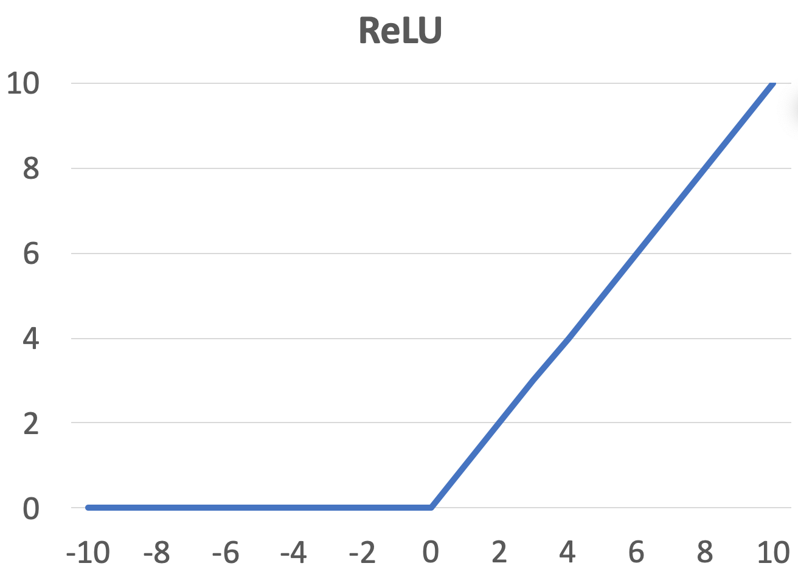

# Machine Learning Terms

Researchers often invent complicated names for simple things. This page will help you uncover the real meaning of those perplexing terms.

<table>
<thead>
<tr>
<th>Term</th>
<th>Human Language Translation</th>
</tr>
</thead>
<tbody>
<tr>
<td valign="top">Rectified Linear Unit (ReLU)</td>
<td>
    
A simple function of <tt>x</tt> returning 0 if <tt>x < 0</tt> or <tt>x</tt> otherwise

    

</td>
</tr>
<tr>
<td valign="top">Embedding</td>
<td>
    
A representation of an object as a list of numbers.

    
Embeddings are commonly used to create representations of objects or features that are suitable for particular machine learning algorithms.

    
One example is working with words in Natural Language Processing. Words are usually transformed to a list of numbers (embedded) before given as input to a neural network. The exact mapping between word and the list of numbers will be automatically learned.

</td>
</tr>
<tr>
<td valign="top">Tensor (as in TensorFlow or PyTorch)</td>
<td>
    
A multidimensional array similar to <tt>numpy.array</tt>

    
Tensor is a term that is used in TensorFlow and PyTorch to indicate a multidimensional array. This may be a bit confusing, because the mathematical term tensor, actually has a different meaning - more like a function.

    
Tensors are data structures that are used to store data. For example, a 1D tensor could store prices of houses, a 2D tensor could store an image, a 3D tensor could store multiple images etc.

</td>
</tr>
<tr>
<td valign="top">Principal Component Analysis (PCA)</td>
<td>
    
An algorithm that removes less important data from a dataset.

    
PCA (as any 'dimensionality reduction' algorithms) helps to reduce the storage space, to improve the performance of the models, and, to ease the data visualization.

    
Technically, it's a statistical procedure that identifies and sorts a small number of uncorrelated variables, called principal components, in such a way that the first one has the most scattered data. So if we want to reduce from <tt>n</tt> to <tt>k</tt> dimensions, we keep the <tt>k</tt>'s first principal components. But the lower is <tt>k</tt> the greater is the information loss.

</td>
</tr>
<tr>
<td valign="top">Kernel (function)</td>
<td>
    
A function that helps to separate datasets that can't be separated with a classic linear approach.

    
A kernel function implicitly finds a higher dimensional space in which a non linearly separable dataset can be easily separated, then project the separation back to the original dataset space.

    
Technically, a kernel function allows making complex non-linear classifiers using any learning algorithm that can be expressed solely in terms of dot products between two vectors.

</td>
</tr>
<tr>
<td valign="top">Parameters</td>
<td>
    
The model parameters are the internal variables of the model that will be updated during the training phase, for example, in the case of neural networks, the weights or biases of the network.

    
In some contexts, it is usual to describe a model by its number of parameters.

</td>
</tr>
<tr>
<td valign="top">Hyperparameters</td>
<td>
    
Hyperparameters specify the model's architecture and how it will be trained. Therefore, these hyperparameters are not learned during training phase. In the case of neural networks, some common hyperparameters are:

    <ul>
        <li>Learning rate</li>
        <li>Batch size</li>
        <li>Number of epochs to train the model</li>
        <li>Number of hidden layers</li>
        <li>Number of neurons in each layer</li>
        <li>Activations functions</li>
    </ul>
</td>
</tr>
<tr>
<td valign="top">Loss Functions</td>
<td>
    
Functions that are used to evaluate the performance of a model and guide the training process.

    
Loss Functions (aka Cost Functions) show the error between what value your model predicts and what the value actually is. Since these functions are generally differentiable (with some exceptions i.e. Hinge Loss), we can apply a Gradient Descent to find the least error. Some common ones are:

    
For Regression Models:

    <ul>
        <li>Mean Absolute Error (MAE)</li>
        <li>Mean Squared Error (MSE)</li>
        <li>Mean Squared Logarithmic Error (MSLE)</li>
    </ul>
    
For Classification Models:

    <ul>
        <li>Binary Cross Entropy Loss</li>
        <li>Categorical Cross Entropy Loss</li>
    </ul>
</td>
</tr>
</tbody>
</table>

Machine Learning terms are one thing the math is another. Get some human language explanation of some confusing terms [here](math-terms.md).
